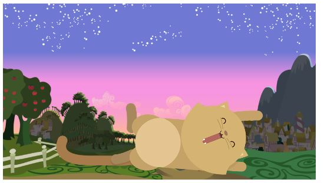
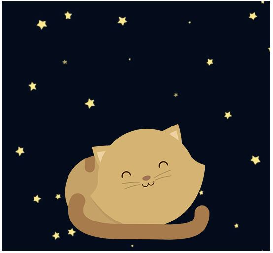
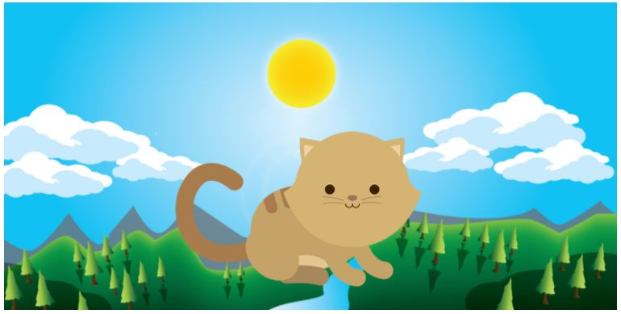

# RETO: KITTEN

* Para este reto se nos solicitó que creemos una página web donde se muestre un paisaje y un gato diferente cada vez según la medida del navegador.

* Apliqué los conocimiento adquiridos en el bootcampo de Laboratoria sobre html, css y media queries.

* Las imágenes fueron proporcionadas por nuestros instructores.

* Nuestro sitio web debe ir variando por las siguientes vistas: 

### Lima, Diciembre del 2017

